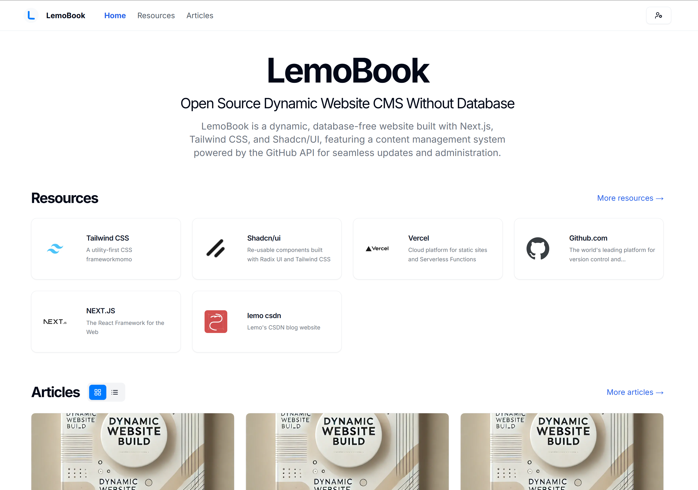
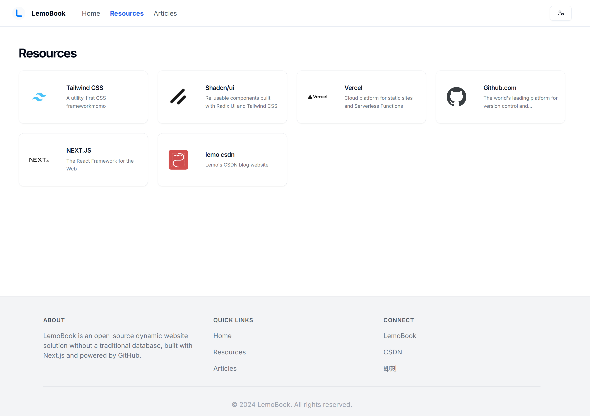
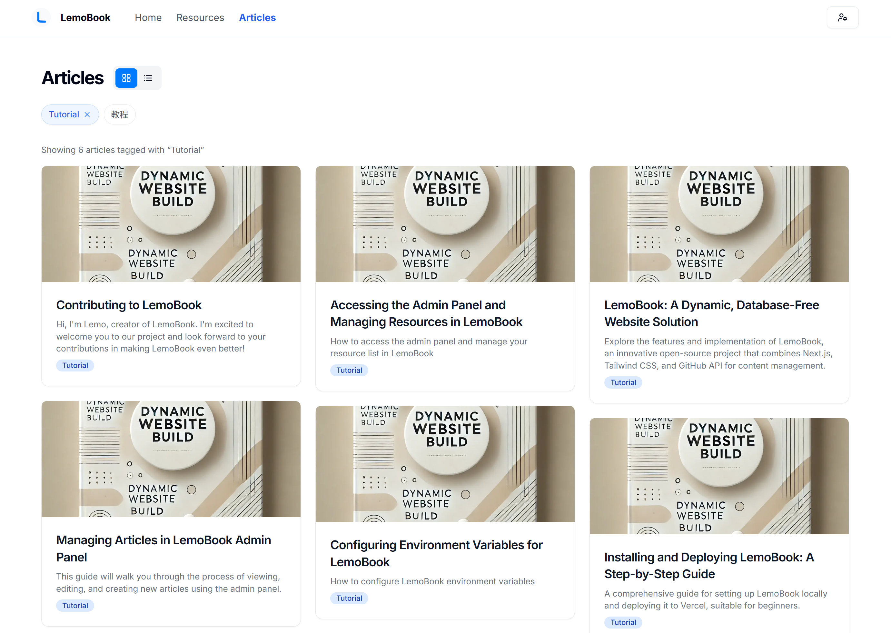
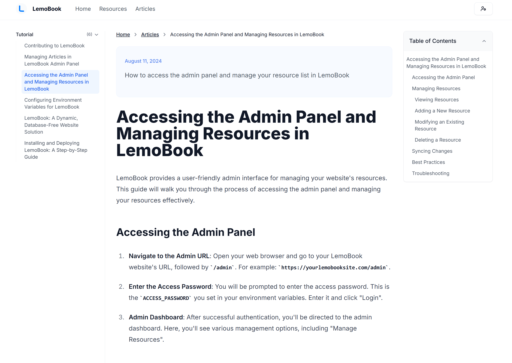
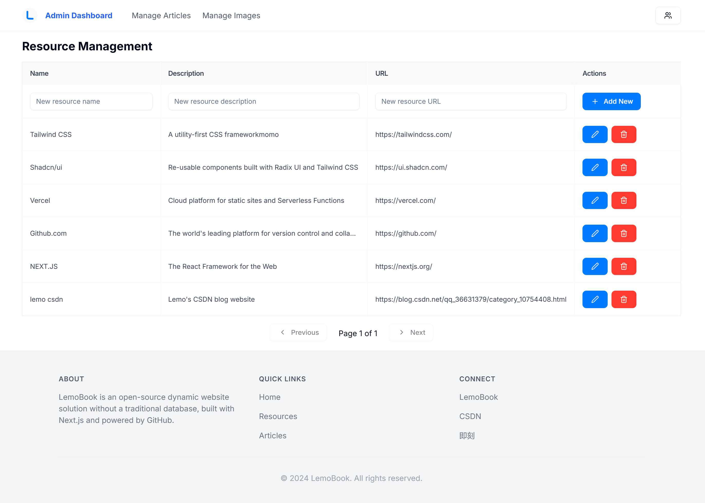
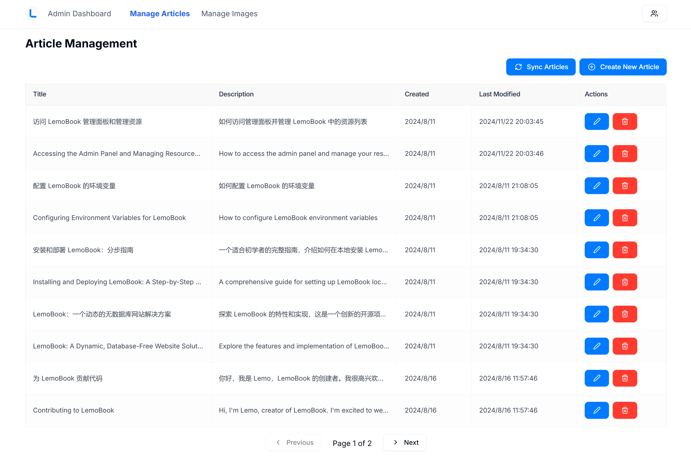
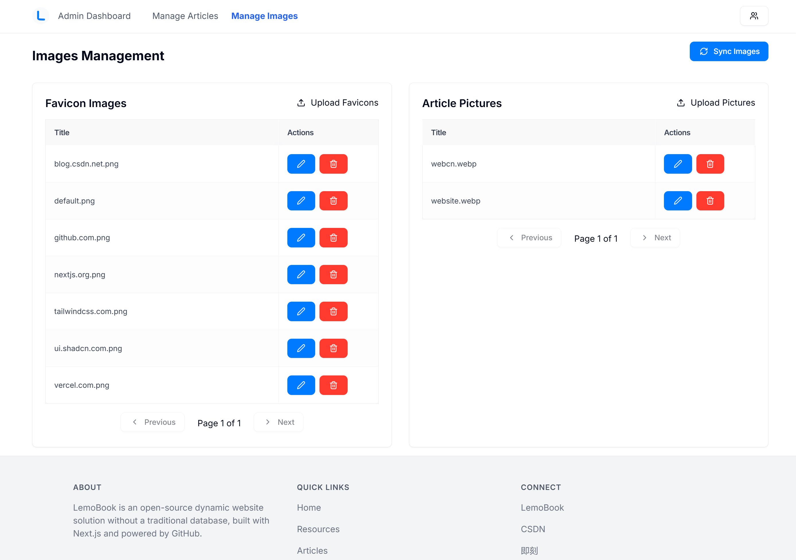

# LemoBook

[LemoBook](https://lemobook.vercel.app/) is an open-source dynamic website solution without a traditional database, built with Next.js, Tailwind CSS, and Shadcn/UI. It leverages GitHub as a content management system, providing a seamless way to create and manage website content.










## Deploy on Vercel

[](https://vercel.com/new/clone?repository-url=https%3A%2F%2Fgithub.com%2Flemoabc%2FGitBase&project-name=LemoBook&repository-name=LemoBook&external-id=https%3A%2F%2Fgithub.com%2Flemoabc%2FGitBase%2Ftree%2Fmain)


## Features

- **Database-free Architecture**: Utilizes GitHub for content storage and management.
- **Dynamic Content**: Renders content dynamically using Next.js server-side rendering.
- **Markdown Support**: Write your content in Markdown format for easy editing and version control.
- **Admin Interface**: Built-in admin panel for content management.
- **Responsive Design**: Fully responsive design using Tailwind CSS.
- **SEO Friendly**: Optimized for search engines with dynamic metadata.
- **Easy Deployment**: Simple deployment process to Vercel.

## Prerequisites

- Node.js (version 14 or later)
- npm (comes with Node.js)
- Git
- GitHub account
- Vercel account (for deployment)

## Installation

1. Clone the repository:
   ```
   git clone https://github.com/lemoabc/gitbase.git
   cd gitbase
   ```

2. Install dependencies:
   ```
   npm install
   ```

3. Create a `.env.local` file in the root directory and add the following:
   ```
   GITHUB_TOKEN=your_github_personal_access_token
   GITHUB_OWNER=your_github_username
   GITHUB_REPO=your_repo_name
   ACCESS_PASSWORD=your_secure_access_password
   ```

4. Set up your GitHub repository:
   - Create a new repository on GitHub
   - Create two folders in the repository: `data/json` and `data/md`
   - In `data/json`, create a file named `resources.json` with an empty array: `[]`

5. Run the development server:
   ```
   npm run dev
   ```

Visit `http://localhost:3000` to see your LemoBook instance running locally.

## Deployment

1. Push your code to GitHub.
2. Log in to Vercel and create a new project from your GitHub repository.
3. Configure the environment variables in Vercel:
   - `GITHUB_TOKEN`
   - `GITHUB_OWNER`
   - `GITHUB_REPO`
   - `ACCESS_PASSWORD`
4. Deploy the project.

For a detailed deployment guide, please refer to our [Installation and Deployment Guide](https://lemobook.vercel.app/posts/gitbase-install-guide).

## Usage

- Access the admin panel by navigating to `/admin` and using your `ACCESS_PASSWORD`.
- Create and edit articles through the admin interface.
- Manage resources in the admin panel.
- All changes are automatically synced with your GitHub repository.

## Contributing

We welcome contributions to LemoBook! Please read our [Contributing Guide](https://lemobook.vercel.app/posts/how-to-contributing-to-gitbase) for details on our code of conduct and the process for submitting pull requests.

## License

LemoBook is open-source software licensed under the [MIT license](https://github.com/lemoabc/gitbase/?tab=MIT-1-ov-file).

## Support

If you encounter any issues or have questions, please file an issue on the GitHub repository.

## Acknowledgements

LemoBook is built with the following open-source libraries:
- [Next.js](https://nextjs.org/)
- [Tailwind CSS](https://tailwindcss.com/)
- [Shadcn/UI](https://ui.shadcn.com/)

We are grateful to the maintainers and contributors of these projects.